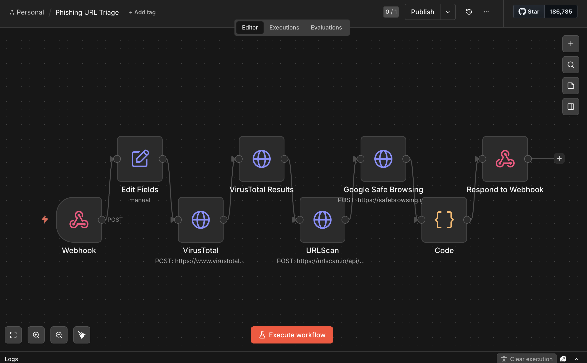

# Phishing URL Triage — n8n Workflow

**Live demo:** https://phishing-url-triage-production.up.railway.app

## Overview

A self-hosted [n8n](https://n8n.io/) workflow that automates the triage of suspicious URLs by querying multiple threat intelligence APIs and aggregating results into a structured verdict.



## Architecture

```
Trigger (Webhook / manual)
  └─► Normalize URL
        ├─► VirusTotal API
        ├─► URLScan.io API
        └─► Google Safe Browsing API
              └─► Aggregate & score
                    └─► Output verdict (JSON / notification)
```

## Setup

**Prerequisites:** Docker and Docker Compose installed.

1. Copy the example env file and fill in your credentials:
   ```bash
   cp .env.example .env
   ```
2. Start n8n:
   ```bash
   docker compose up -d
   ```
3. Open `http://localhost:5678` and log in with your `N8N_BASIC_AUTH_USER` / `N8N_BASIC_AUTH_PASSWORD`.
4. Import the workflow from `workflows/` via the n8n UI (**Workflows → Import from file**).

## Workflow Walkthrough

1. **Manual Trigger** — starts the workflow on demand (swap for a Webhook node to accept URLs via HTTP POST in production)
2. **Edit Fields (Set)** — defines the target URL as `$json.url`, the single input passed through the entire chain
3. **VirusTotal (POST)** — submits the URL to the VirusTotal v3 API (`/api/v3/urls`), which returns an analysis ID
4. **VirusTotal Results (GET)** — fetches the completed report using the analysis ID (`/api/v3/analyses/{id}`); extracts malicious/suspicious/clean engine counts
5. **URLScan** — submits the URL to URLScan.io (`/api/v1/scan/`) with `visibility: unlisted`; returns a UUID used to build the report link
6. **Google Safe Browsing** — POSTs to the Safe Browsing v4 `threatMatches:find` endpoint checking for MALWARE, SOCIAL_ENGINEERING, UNWANTED_SOFTWARE, and POTENTIALLY_HARMFUL_APPLICATION across ANY_PLATFORM
7. **Code (aggregate)** — combines all three results into a single verdict object; verdict logic: any VT malicious detections or GSB matches → `MALICIOUS`; VT suspicious only → `SUSPICIOUS`; otherwise → `CLEAN`

## Sample Output

```json
{
  "url": "http://testsafebrowsing.appspot.com/s/malware.html",
  "verdict": "MALICIOUS",
  "virustotal": {
    "malicious": 11,
    "suspicious": 0,
    "clean": 16
  },
  "urlscan": {
    "reportUrl": "https://urlscan.io/result/019df50e-1210-77a6-b3e9-d1e05be58e53"
  },
  "googleSafeBrowsing": {
    "threats": 1,
    "details": [
      {
        "threatType": "MALWARE",
        "platformType": "ANY_PLATFORM",
        "threatEntryType": "URL"
      }
    ]
  },
  "scannedAt": "2026-05-04T22:16:17.039Z"
}
```

## Lessons Learned

**VirusTotal v3 requires a two-step lookup.** You can't query a URL directly — you first POST to `/api/v3/urls` to submit it, which returns an analysis ID, then GET `/api/v3/analyses/{id}` to fetch the results. A direct GET returns a 404 if the URL has no cached report.

**Google Safe Browsing returns an empty response for clean URLs.** An empty `{}` body is not an error — it means no threats were found. The `matches` array only appears when a threat is detected, so the absence of it is the clean signal.

**URLScan.io reports take 30–60 seconds to generate.** The API returns a UUID immediately on submission, but the full report at `urlscan.io/result/{uuid}` won't load until the scan completes. A production implementation would poll the result endpoint until ready.

**n8n credentials don't export with workflows.** When importing a workflow JSON into a new n8n instance, all credential references are stripped for security. Each API credential has to be re-created manually in the new instance.

**n8n blocks environment variable access in nodes by default.** `$env.VARIABLE_NAME` expressions are disabled unless `N8N_BLOCK_ENV_ACCESS_IN_NODE=false` is set. The better approach for API keys is to use n8n's built-in credential store, which is what this project does.

**Railway's Docker image field accepts Docker Hub image names directly.** `n8nio/n8n` works — the `docker.n8n.io/` registry prefix causes a validation error in Railway's UI.

